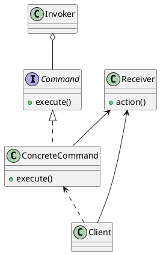

# 设计模式笔记-命令模式


<!--more-->

## 什么是命令模式
在一些如使用请求队列的场景中，请求的执行者和请求的发出者不是一个，而具体的请求（行为）差异很大.

命令模式，将具体的请求（这里的请求可以认为是一些行为），抽象为对象，来达到发出请求的对象和执行请求的对象之间的解耦。

## UML 图以及说明

<!-- 

-->
- Receiver：具体的请求对象，action 方法是请求执行的具体行为。当然，其他请求的行为不一定是 action 方法。
- Command：是抽象的命令接口。
- ConcreteCommand：某个具体的 Command，里面包装了一个 Receiver。
- Client：用来将 Receiver 封装为 Command。
- Invoker：请求的执行者。在这里 Invoker 不必关注 Receiver 的具体细节，只执行 Command 的 execute 方法即可，与 Receiver 和 Client 解耦。

## 代码示例
```go
package designpattern

import "fmt"

//Command 命令的抽象接口
//不考虑撤销等操作的话，也可以直接用闭包
type Command interface {
	Exe()
}

//Invoker 执行 Command
type Invoker struct {
}

//Run 执行 Command 的 Exe
func (i Invoker) Run(c Command) {
	c.Exe()
}

//ReceiverA 具体的 Receiver 对象
type ReceiverA struct {
}

//Action 具体的行为
func (r ReceiverA) Action() {
	fmt.Println("receiver a action")
}

//ReceiverB 具体的 Receiver 对象
type ReceiverB struct {
}

//Action1 具体行为
func (r ReceiverB) Action1() {
	fmt.Println("receiver b action 1")
}

//Action2 具体行为
func (r ReceiverB) Action2() {
	fmt.Println("receiver b action 2")
}

//CommandA 具体的 Command
type CommandA struct {
	r ReceiverA
}

//Exe 执行具体的请求
func (c CommandA) Exe() {
	c.r.Action()
}

//CommandB 具体的 Command
type CommandB struct {
	r ReceiverB
}

//Exe 执行具体请求
func (c CommandB) Exe() {
	c.r.Action1()
	c.r.Action2()
}

//NewCommandA 生成 CommandA 实例
func NewCommandA(r ReceiverA) Command {
	return CommandA{
		r: r,
	}
}

//NewCommandB 生成 CommandA 实例
func NewCommandB(r ReceiverB) Command {
	return CommandB{
		r: r,
	}
}

```

测试代码及运行结果
```go
func TestCommand(t *testing.T) {
	//client 的封装工作
	ca := designpattern.NewCommandA(designpattern.ReceiverA{})
	cb := designpattern.NewCommandB(designpattern.ReceiverB{})

	invoke := designpattern.Invoker{}

	invoke.Run(ca)
	invoke.Run(cb)
}

```

```
receiver a action
receiver b action 1
receiver b action 2
PASS
```

