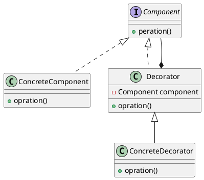

# 设计模式笔记-装饰者模式


<!--more-->

## 什么是装饰者模式
也叫修饰模式，通过增加一个**修饰类**包裹原来的类的方式，来达到**在运行时扩充一个类的功能**。

- 修饰类要与原来的类有相同的接口。
- 包裹方式一般是要包裹的类是修饰类的私有成员变量。
- 如果不需要新功能，直接调用原来的类的接口。
- 新功能一般通过调用原来的类的函数，再加上修饰类的额外逻辑。

## 类图


<!--

-->

## 说明
- Component 是修饰类，和原来的类要实现的接口。（是一个基类也可以）
- ConcreteComponent 是Component 的一个具体的类，可以理解为是要被包裹的，原来的函数。
- Decorator 是修饰类，里面的私有成员变量 component 是要被包裹的类，由于 Decorator 同样实现 Component 接口，Decorator 同样可以被包裹。
- ConcreteDecorator 是一个具体的 Decorator 一般来说，可以是“修饰行为”不同的一个修饰类。这里“修饰行为”可以认为是，Decorator 调用自身 component 的 opration 函数时额外执行的操作。

相对于使用继承的方式，修饰者模式使用**组合**，可以在动态的添加新的行为，不需要增加子类，更加灵活。

对于一些场景，比如奶茶店，同样的奶茶，可能有半糖，少糖；加冰，常温这种不同的选项，使用组合的方式是更加合理的，否则需要针对不同的定义不同的子类，而这种场景无法穷尽这些场景。

在上面奶茶的 case 下，我们认为不同的奶茶（原味，红豆奶茶）认为是要包裹的类，将类似半糖少糖的逻辑定义在修饰类，通过层层包裹实现不同的功能（不同类型的奶茶）。

> golang 没有继承，所谓的继承实际上就是将“基类”作为自己的成员变量，调用接口的时候，直接调用“基类”的接口实现。

## 代码实现
```go
package designpattern

//Component 装饰者要实现的接口
type Component interface {
	Operation() string
}

//ConcreteComponent 一个具体的 Component 不是装饰者
type ConcreteComponent struct {
}

//Operation ConcreteComponent 的函数
func (c *ConcreteComponent) Operation() string {
	return "面条"
}

//Decorator 装饰者
type Decorator struct {
	c Component //要包裹的类
}

//NewDecorator 生成 Decorator 实例
func NewDecorator(c Component) *Decorator {
	return &Decorator{
		c: c,
	}
}

//Operation 装饰者实现
func (d *Decorator) Operation() string {
	return d.c.Operation() + "加个鸡蛋"
}

//Decorator2 另一个装饰者
type Decorator2 struct {
	c Component //要包裹的类
}

//NewDecorator2 生成 Decorator2 实例
func NewDecorator2(c Component) *Decorator2 {
	return &Decorator2{
		c: c,
	}
}

//Operation 装饰者实现
func (d *Decorator2) Operation() string {
	return d.c.Operation() + "加个鸡腿"
}
```

测试代码：
```go
func TestDecorator(t *testing.T) {
	d := designpattern.NewDecorator(&designpattern.ConcreteComponent{})

	t.Log(d.Operation())

	d2 := designpattern.NewDecorator2(d)

	t.Log(d2.Operation())
}
```

测试结果：
```
=== RUN   TestDecorator
    TestDecorator: pattern_test.go:48: 面条加个鸡蛋
    TestDecorator: pattern_test.go:52: 面条加个鸡蛋加个鸡腿
--- PASS: TestDecorator (0.00s)
PASS
```

