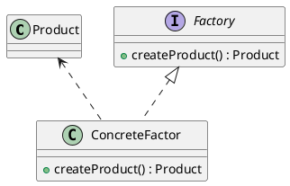
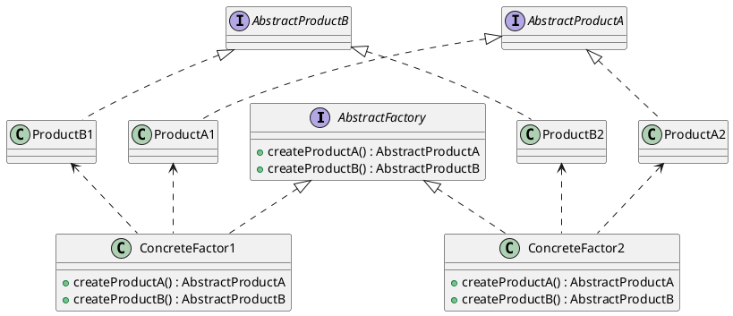

# 设计模式笔记-工厂模式

<!--more-->

## 工厂模式
在 java 或者 C++ 这种支持面向对象的语言中，创建一个新的对象，往往要使用类似 `new Object()` 的方式在创建对象，而使用这种方式必须知道要创建的那个 Object 的具体类型。

在设计模式中，**针对接口，而不是针对实现编程**是一个设计原则。使用 `new Object()` 的方式，会在让使用者与 Object 的具体实现有耦合，显然违反了上诉原则。

假如，把我们要创建的结构体称之为“产品”，具体的产品不止一种，我们需要在不同的场景下生成不同的产品。为了避免代码重复（DRY 原则），将创建产品类的逻辑封装到一个类里面，这个类就是工厂类。

根据 [wiki 百科](https://zh.wikipedia.org/wiki/%E5%B7%A5%E5%8E%82%E6%96%B9%E6%B3%95)的描述，工厂模式的定义为：工厂通常是一个用来创建其他对象的对象。工厂是构造方法的抽象，用来实现不同的分配方案。

UML 图如下：

<!--

-->

图中，Factory 是工厂的接口。ConcreteFactor 是具体实现，由 ConcreteFactor 创建具体的 Product

## 抽象工厂模式
在上边的类图中，工厂类是创建的是**一个**对象。如果需要的是若干个对象。则需要抽象工厂模式。

按照 [wiki 百科](https://zh.wikipedia.org/wiki/%E6%8A%BD%E8%B1%A1%E5%B7%A5%E5%8E%82)抽象工厂模式的实质是“提供接口，创建一系列相关或独立的对象，而不指定这些对象的具体类。”

uml 类图：

<!--

-->

可以理解为，抽象工厂将一组具有同一主题的单独的工厂封装起来。（这些工厂提供的产品可以理解为是别的东西的原料，不是一个产品，但是多少有点关联）

