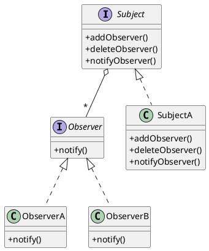

# 设计模式笔记-观察者模式


<!--more-->

## 什么是观察者模式
一个主题（Subject，也是被观察者）自身状态变更时，需要通过观察者提供的方法通知观察该主题的对象（ObServer 观察者）。

- Subject 状态变更需要同步给 ObServer
- 可能有多个（0个或多个）ObServer 需要订阅 Subject 的状态
- Subject 通过调用约定的 ObServer 方法来通知变更（这个约定的接口，就是 ObServer 要实现的接口）


## 类图及说明

<!--

-->
在类图中，Subject 是主题的接口约定。

- addObserver 和 deleteObserver 方法用于观察者订阅和取消订阅。
- notifyObserver 用于主题在自身状态变化后，通知观察者，具体实现上，会调用订阅了的观察者的 notify 方法。

Observer 是观察者的接口约定。
- notify 方法用于 Subject 通知观察者时调用。

通过接口约定，Subject 不需要关系订阅自身消息的观察者的具体实现，只要实现了 Observer 的接口即可，实现了与观察者的解耦（ 对 Observer 来说，也不用关心 Subject 的具体实现 ）。

## 代码实现
go 代码实现：
```go
package designpattern

import "fmt"

//Subject 主题
type Subject interface {
	AddObserver(name string, o Observer)
	DeleteObserver(name string)
	NotifyObserver()
}

//Observer 观察者
type Observer interface {
	Notify(int)
}

//SubjectA 具体主题
type SubjectA struct {
	i int //要同步的状态

	m map[string]Observer //保存订阅者的列表，为了方便用map实现，因示例中没有并发问题，没有用锁
}

//NewSubjectA 创建 SubjectA 实例
func NewSubjectA() *SubjectA {
	return &SubjectA{
		m: make(map[string]Observer),
	}
}

//AddObserver 观察者订阅
func (s *SubjectA) AddObserver(name string, o Observer) {
	s.m[name] = o
}

//DeleteObserver 观察者取消订阅
func (s *SubjectA) DeleteObserver(name string) {
	delete(s.m, name)
}

//NotifyObserver 通知观察者
func (s *SubjectA) NotifyObserver() {
	s.i++
	for _, o := range s.m {
		o.Notify(s.i)
	}
}

//ObserverA 观察者实例
type ObserverA struct {
	i int
}

//Notify 获取通知
func (o *ObserverA) Notify(i int) {
	o.i = i
}

//Display 展示
func (o *ObserverA) Display() {
	fmt.Println(o.i)
}

```

测试代码：
```go
func TestObserverPattern(t *testing.T) {
	s := designpattern.NewSubjectA()

	o1 := new(designpattern.ObserverA)
	o2 := new(designpattern.ObserverA)

	s.AddObserver("1", o1)
	s.AddObserver("2", o2)

	s.NotifyObserver()

	fmt.Println("===第一次通知===")
	o1.Display()
	o2.Display()

	s.DeleteObserver("2")

	s.NotifyObserver()

	fmt.Println("===第二次通知===")
	o1.Display()
	o2.Display()
}
```

返回结果：
```
=== RUN   TestObserverPattern
===第一次通知===
1
1
===第二次通知===
2
1
--- PASS: TestObserverPattern (0.00s)
PASS
ok  	designpattern	0.354s
```


